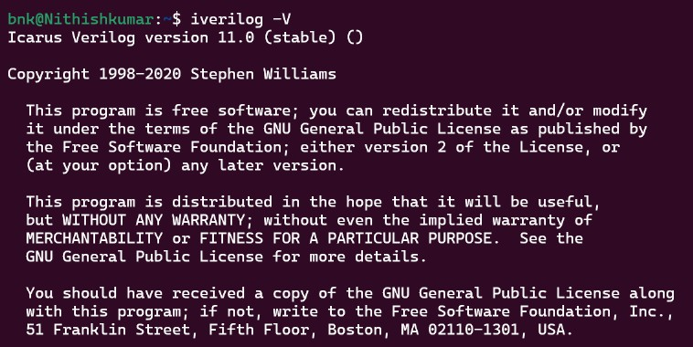

# 🖥️ Week 0 – Environment Setup & Tool Installation  

This week’s task is to set up the required EDA tools in a **Linux environment**.  
I am using **WSL (Windows Subsystem for Linux)** with **Ubuntu 22.04 LTS (Jammy Jellyfish)** for this program.  

## ✅ System Check  

- **Platform:** Windows (with WSL)  
- **Linux Distro:** Ubuntu 22.04 (Jammy Jellyfish)  
- **Shell:** bash  
- **Purpose:** To provide a stable environment for RISC-V SoC Tapeout program

## 🛠️ Tools Installed  

1. **Yosys** – RTL synthesis tool  
2. **Icarus Verilog (iverilog)** – Verilog simulation  
3. **GTKWave** – Waveform viewer

### WSL and Ubuntu Setup

```powershell
wsl --install -d Ubuntu-22.04
```
```bash
sudo apt update && sudo apt upgrade -y
sudo apt install -y build-essential git make python3 python3-venv python3-pip pkg-config curl wget
```


### Yosys Installation

```bash
sudo apt update

sudo apt install -y build-essential clang bison flex \
libreadline-dev gawk tcl-dev libffi-dev git \
graphviz xdot pkg-config python3 \
libboost-system-dev libboost-python-dev libboost-filesystem-dev zlib1g-dev

git clone https://github.com/YosysHQ/yosys.git
cd yosys
make config-gcc
make -j$(nproc)
sudo make install
```
!(Images/yosys_setup.jpg)

### Icarcus Verilog Installation
```bash
sudo apt install -y iverilog
```


### GTKWave Verilog Installation

```bash
sudo apt install -y gtkwave
```


