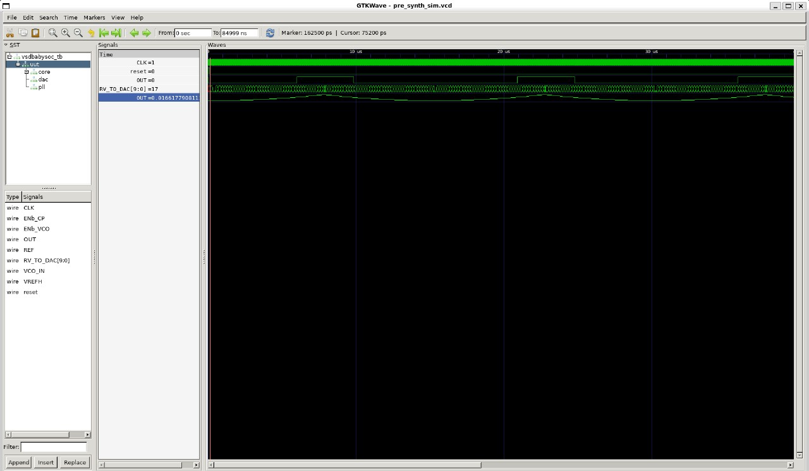
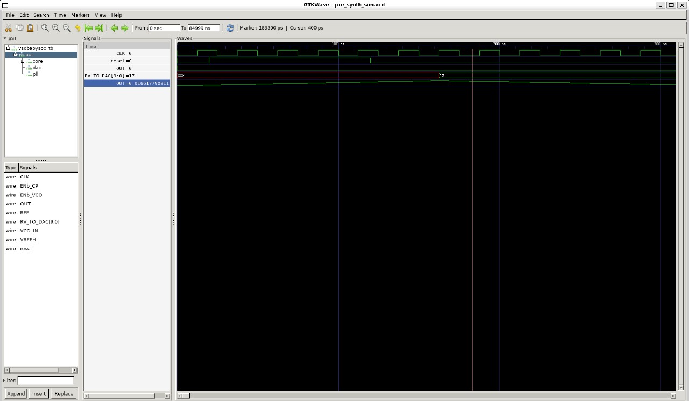
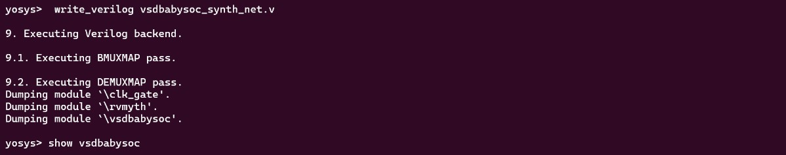
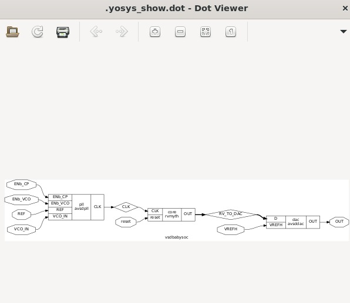

# 📘 Week 2 – BabySoC Fundamentals & Functional Modelling

## 🎯 Objective
The goal of Week 2 is to:
1. Build a solid understanding of **SoC fundamentals**.
2. Practice **functional modelling** of the BabySoC using **Icarus Verilog** and **GTKWave**.

---

## 📖 Part 1 – Theory (Conceptual Understanding)

### Notes
We are designing a compact SoC (**BabySoC**) based on **RVMYTH** (RISC-V processor).  
It incorporates:
- **PLL (Phase Locked Loop)** for stable clock generation.
- **10-bit DAC** for analog output to external devices.  

We use the **Skywater Sky130nm PDK**, an open-source process design kit.

---

### What is a SoC?
A **System-on-Chip** is a miniaturized computer with multiple functions integrated onto a single chip.  
**Pros:** High performance, compact, low power, reliable.  
**Cons:** Complex design, overheating, less customizable.

---

### Components of a Typical SoC
- CPU  
- GPU  
- I/O Ports  
- Power Management  
- DSP (Digital Signal Processing)  
- Wireless Communication Blocks  
- Memory (RAM/Flash)  

---

### Types of SoC
- Microcontroller SoC  
- Microprocessor SoC  
- Application-Specific SoC (ASIC-based)  

---

### SoC Design Flow

**Hardware:**  
Architecture → HDL Coding → RTL Design → Simulation & Verification → Synthesis & DFT → Netlist → Placement & Routing → Timing/Sign-off → Physical Verification → GDSII → Fabrication → Post-silicon Verification  

**Software:**  
Developed in parallel, co-simulated with RTL, refined, and used in post-silicon verification.  

---

### BabySoC Overview
Primary objective: Test **open-source IPs** and calibrate analog components.

**Components:**
- **RVMYTH Processor:** RISC-V based, cyclic operation for DAC control & DSP processing.  
- **PLL:** Ensures synchronous operation, corrects frequency & phase mismatches.  
- **DAC (10-bit):** Converts digital signals to analog outputs (audio/video).

**Why not external clock?**
- High ppm error, aging effects, jitter and external factors like temperature.  
- Poor distribution causes timing mismatches.  

**DAC Types:** Weighted resistor, R-2R ladder.  
Weighted resistors use different type of weighted resistor as a network to feed the digital input to DAC, likewise R-2R ladder use unique resistor networks to feed the digital input to DAC
BabySoC uses a **10-bit DAC** for digital-to-analog conversion and file output.

---

### Important Questions
1. **Why BabySoC is a simplified model?**  
   → Compact, easy to learn, tests open IPs (PLL & DAC), RVMYTH core is simple & customizable.  
2. **Role of functional modelling before RTL & physical design?**  
   → Represents **what the chip does**, not how it’s built. Critical for verification and parallel software development, saving costs before fabrication.

---


## 📖 Part 2 – Labs (Hands-on Functional Modelling)
<details>
<summary><h2>VSDBABYSOC-SETUP</h2></summary>
   
### Tools Installed
- **Icarus Verilog (`iverilog`)** → compile Verilog modules.  
- **GTKWave** → view waveform files (`.vcd`).  

### Steps Followed

1. **System Update and Dependencies**
```bash
sudo apt update
sudo apt install python3 python3-venv python3-pip -y
```
```bash
cd ~/VLSI
git clone https://github.com/manili/VSDBabySoC.git
cd VSDBabySoC
```
```bash
python3 -m venv sp_env
source sp_env/bin/activate
```
```bash
pip install --upgrade pip
pip install pyyaml click sandpiper-saas
which sandpiper-saas
# Should show: ~/VLSI/VSDBabySoC/sp_env/bin/sandpiper-saas
```
```bash
sandpiper-saas -i ./src/module/*.tlv \
               -o rvmyth.v \
               --bestsv \
               --noline \
               -p verilog \
               --outdir ./src/module/
```
</details>

<details>
<summary><h2>PRE_SYNTHESIS</h2></summary>
   
```bash
mkdir -p output/pre_synth_sim
iverilog -o output/pre_synth_sim/pre_synth_sim.out \
  -DPRE_SYNTH_SIM \
  -I src/include -I src/module \
  src/module/testbench.v
```
```bash
cd output/pre_synth_sim
./pre_synth_sim.out
gtkwave pre_synth_sim.vcd
```
## Presynthesis Implementation


## Final Folder Tree Setup will be like:

```txt
~/VLSIVSDBabySoC/
├── src/
│   ├── include/
│   │   ├── sandpiper.vh
│   │   └── other header files...
│   ├── module/
│   │   ├── vsdbabysoc.v      # Top-level module integrating all components
│   │   ├── rvmyth.v          # RISC-V core module
│   │   ├── avsdpll.v         # PLL module
│   │   ├── avsddac.v         # DAC module
│   │   └── testbench.v       # Testbench for simulation
└── output/
└── compiled_tlv/         # Holds compiled intermediate files if needed
```
## 🔍 Pre-Synthesis Simulation Observations

### ⏱️ Clock
- **Asserted** at `12.5 ns`, **deasserted** at `25 ns`
- Effective clock period = `25 ns`
- Frequency = **1 / 25 ns = 40 MHz**

👉 Note: `12.5 ns` is the half-period, so the full cycle is 25 ns → 40 MHz.

### 🎚 RV → DAC Conversion
- `rv_to_dac` produces a 10-bit digital value (`0–1023`)
- DAC output is computed as:
```
V_OUT = rv_to_dac/1023
Example from the Simulation: if `rv_to_dac = 117
  V_OUT = 17/1023
  V_OUT = 0.166 (The Calculation is matchning with output
```

</details>

<details>
<summary><h2>RTL-SYNTHESIS</h2></summary>

> All paths in the commands below are relative to `VSDBabySoC/`.
**Open Yosys**
```bash
yosys
read_verilog -sv -I src/include/ -I src/module/ src/module/vsdbabysoc.v src/module/clk_gate.v src/module/rvmyth.v
```
```bash
read_liberty -lib src/lib/sky130_fd_sc_hd__tt_025C_1v80.lib
read_liberty -lib src/lib/avsddac.lib
read_liberty -lib src/lib/avsdpll.lib
read_liberty -lib src/lib/sky130_fd_sc_hd__tt_025C_1v80.lib
```
```bash
synth -top vsdbabysoc
write_verilog vsdbabysoc_synth_net.v
show vsdbabysoc
```



</details>
<details>
<summary><h2>POST-SYNTHESIS</h2></summary>

</details>

