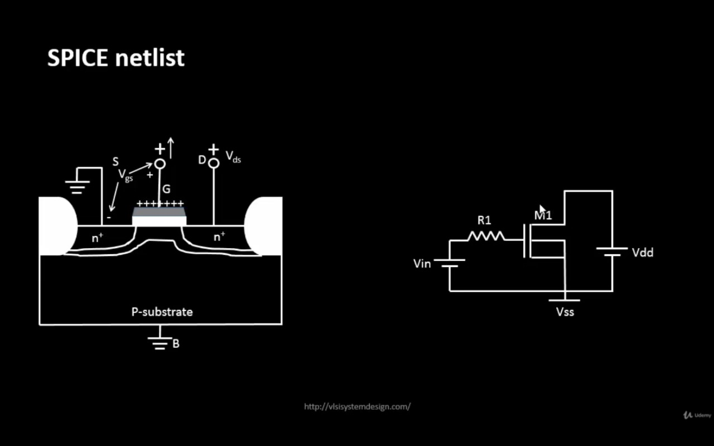

# Week 4 — CMOS Circuit Design & SPICE Simulation  
**Day 1**

---

## Overview
Day 1 focuses on transistor-level CMOS behavior, how MOSFET W/L ratio affects delay, and how SPICE validates timing models used by STA (OpenSTA).

---

## CMOS Basics
- **PMOS**: N-type substrate, P-type doping (minority P, majority N)  
- **NMOS**: P-type substrate, N-type doping (minority N, majority P)  
- **W/L ratio** controls drain current → affects propagation delay.  
- Delay tables (input slew vs output load) are generated using **SPICE**, then used by **STA**.

---

## Semiconductor & PN Junction Revision
- Extrinsic semiconductors are formed by doping:
  - P-type: trivalent dopants (B, Al, Ga)
  - N-type: pentavalent dopants (P, As, Sb)
- PN junction creates depletion region and built-in potential:
  - Silicon ≈ 0.7 V
  - Germanium ≈ 0.3 V

### Biasing:
- Forward bias → depletion shrinks → current flows  
- Reverse bias → depletion widens → current blocked (only small leakage)

---

## MOSFET Basics (NMOS Example)
- Terminals: Gate, Source, Drain, Body  
- P-type substrate, SiO2 oxide, N+ source/drain regions  
- Operation depends on VGS and VDS.

---

## NMOS Operation Modes

### 1. Cut-Off Region (Case 0)
- VGS < Vth
- No inversion layer
- Very high resistance, no current.

---

### 2. Threshold Formation (Case 1)
- VGS increases
- Gate attracts electrons → inversion layer forms
- At VGS = Vth → channel created
- Body effect increases Vth when source-body reverse bias exists.

---

### 3. Linear (Triode) Region (Case 2)
- VGS > Vth
- VDS < (VGS - Vth)
- Channel exists from source to drain
- MOSFET behaves like a variable resistor

**Full Drain Current Equation (Linear Region):**

ID = μn * Cox * (W/L) * [ (VGS - Vth) * VDS - (VDS² / 2) ]

OR using kn = μn * Cox * (W/L):

ID = kn * [ (VGS - Vth) * VDS - (VDS² / 2) ]

**For very small VDS:**

ID ≈ kn * (VGS - Vth) * VDS

---

### 4. Saturation Region
- Pinch-off when VDS ≥ (VGS - Vth)
- Channel disappears near drain side
- Current becomes almost independent of VDS

**Full Drain Current Equation (Saturation Region, no channel-length modulation):**

ID = (1/2) * μn * Cox * (W/L) * (VGS - Vth)²

OR

ID = (1/2) * kn * (VGS - Vth)²

**With channel-length modulation (λ):**

ID = (1/2) * kn * (VGS - Vth)² * (1 + λ * VDS)

This shows ID slightly depends on VDS due to effective channel shortening.

---

## SPICE vs STA
- STA uses delay tables generated from SPICE data.
- SPICE simulates transistor-level models to extract delay, slew, and current.
- SPICE verifies STA assumptions.

---

# Week 4 – CMOS Circuit Design & SPICE Simulation  
**Lab – Day 1**

---

## 1) SPICE Netlist
This image shows the SPICE netlist used for the simulation.

---

## 2) SPICE Code
The SPICE code for the circuit and model definitions.

---

## 3) SPICE Simulation
The simulation setup and waveform analysis view in SPICE.

---

## 4) SPICE Output
Output results after running the SPICE simulation.

---

## 5) VDS and ID Value of One Instance
Shows the drain-source voltage (VDS) and drain current (ID) for one MOSFET instance.

