# Week 4 — CMOS Circuit Design & SPICE Simulation  

# Day 1

---

## Overview
Day 1 focuses on transistor-level CMOS behavior, how MOSFET W/L ratio affects delay, and how SPICE validates timing models used by STA (OpenSTA).

---

## CMOS Basics
- **PMOS**: N-type substrate, P-type doping (minority P, majority N)  
- **NMOS**: P-type substrate, N-type doping (minority N, majority P)  
- **W/L ratio** controls drain current → affects propagation delay.  
- Delay tables (input slew vs output load) are generated using **SPICE**, then used by **STA**.

---

## Semiconductor & PN Junction Revision
- Extrinsic semiconductors are formed by doping:
  - P-type: trivalent dopants (B, Al, Ga)
  - N-type: pentavalent dopants (P, As, Sb)
- PN junction creates depletion region and built-in potential:
  - Silicon ≈ 0.7 V
  - Germanium ≈ 0.3 V

### Biasing:
- Forward bias → depletion shrinks → current flows  
- Reverse bias → depletion widens → current blocked (only small leakage)

---

## MOSFET Basics (NMOS Example)
- Terminals: Gate, Source, Drain, Body  
- P-type substrate, SiO2 oxide, N+ source/drain regions  
- Operation depends on VGS and VDS.

---

## NMOS Operation Modes

### 1. Cut-Off Region (Case 0)
- VGS < Vth
- No inversion layer
- Very high resistance, no current.

---

### 2. Threshold Formation (Case 1)
- VGS increases
- Gate attracts electrons → inversion layer forms
- At VGS = Vth → channel created
- Body effect increases Vth when source-body reverse bias exists.

---

### 3. Linear (Triode) Region (Case 2)
- VGS > Vth
- VDS < (VGS - Vth)
- Channel exists from source to drain
- MOSFET behaves like a variable resistor

**Full Drain Current Equation (Linear Region):**

ID = μn * Cox * (W/L) * [ (VGS - Vth) * VDS - (VDS² / 2) ]

OR using kn = μn * Cox * (W/L):

ID = kn * [ (VGS - Vth) * VDS - (VDS² / 2) ]

**For very small VDS:**

ID ≈ kn * (VGS - Vth) * VDS

---

### 4. Saturation Region
- Pinch-off when VDS ≥ (VGS - Vth)
- Channel disappears near drain side
- Current becomes almost independent of VDS

**Full Drain Current Equation (Saturation Region, no channel-length modulation):**

ID = (1/2) * μn * Cox * (W/L) * (VGS - Vth)²

OR

ID = (1/2) * kn * (VGS - Vth)²

**With channel-length modulation (λ):**

ID = (1/2) * kn * (VGS - Vth)² * (1 + λ * VDS)

This shows ID slightly depends on VDS due to effective channel shortening.

---

## SPICE vs STA
- STA uses delay tables generated from SPICE data.
- SPICE simulates transistor-level models to extract delay, slew, and current.
- SPICE verifies STA assumptions.

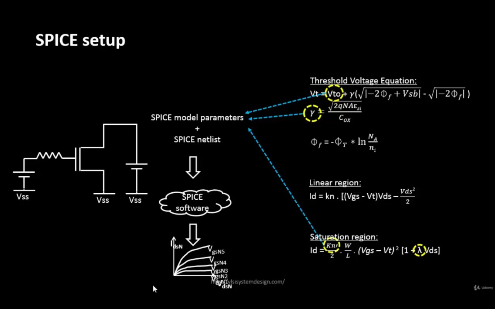

---

# Week 4 – CMOS Circuit Design & SPICE Simulation  
**Lab – Day 1**

---

## 1) SPICE Netlist
This image shows the SPICE netlist used for the simulation.

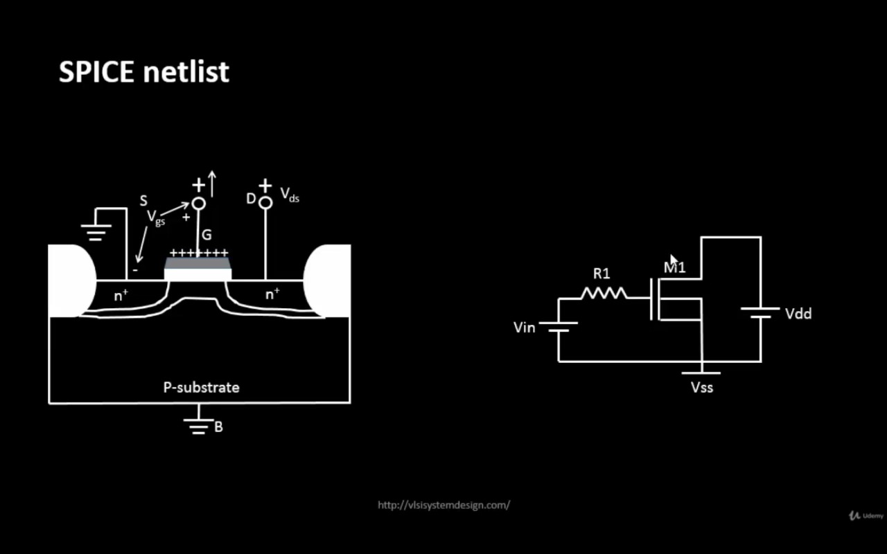

---

## 2) SPICE Code
The SPICE code for the circuit and model definitions.

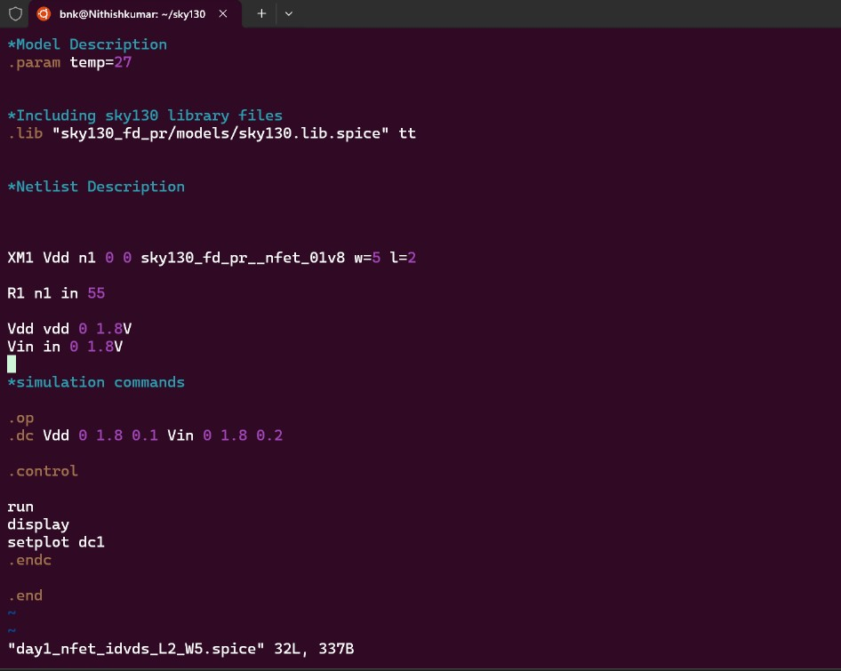

---

## 3) SPICE Simulation
The simulation setup and waveform analysis view in SPICE.
```bash
ngspice day1_nfet_idvds_L2_W5.spice 
```
```ngspice 
plot -vdd#branch
```

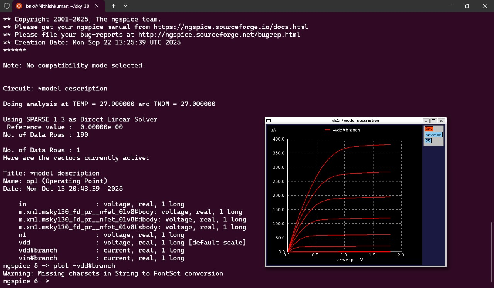

---

## 4) SPICE Output
Output results after running the SPICE simulation.


---

## 5) VDS and ID Value of One Instance
Shows the drain-source voltage (VDS) and drain current (ID) for one MOSFET instance.

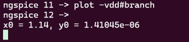


# Day 2

---

## Overview
Day 2 focuses on short-channel NMOS effects, CMOS voltage transfer characteristics (VTC), and the impact of channel length on drain current.  

---

## Short Channel NMOS Effects
- Two NMOS transistors with **same W/L ratio** but different **absolute W and L** show different Id vs VGS curves.
- For **short channel devices (L = 250 nm)**:
  - ID vs VGS shows **linear dependence** even after pinch-off (VDS > VGS - Vth)
  - This is due to **velocity saturation effect**:  
    - At high electric fields, carrier velocity saturates due to scattering.
    - Velocity is proportional to induced charges; at short channel, velocity saturates at **Vsat**.

### NMOS Operating Regions (short channel)
1. Cut-off
2. Linear (triode)
3. Saturation
4. Velocity Saturation

### Full Drain Current Equation (Short Channel, unified model)
ID = kn * (VGS-vmin) –( Vmin² /2)* (1 + λ * VDS)


Where:  
 vmin = min(vgs(saturation mode),vds(linear mode),vsat(velocity saturation mode))
 
**Observation:**  
- Shorter channel length reduces drain current, longer length increases it.
- Although W/L ratio is same, absolute length affects ID directly.

---

## CMOS Voltage Transfer Characteristics (VTC)

### NMOS
- Gate = VDD, Body = GND  
- Can pass **0** from source easily (VGS > Vth)  
- If source = VDD, NMOS passes up to **VDS - Vth**  
- NMOS acts as **strong 0, weak 1** pull-down transistor

### PMOS
- Gate = GND, Body = VDD  
- Can pass **VDD** from source easily (VSG > Vth)  
- If source = 0, PMOS passes up to **Vth**  
- PMOS acts as **strong 1, weak 0** pull-up transistor

### CMOS
- If VIN = VDD → NMOS on → load capacitor discharged  
- If VIN = 0 → PMOS on → load capacitor charged  

---

### Nomenclature
| Symbol | Description |
|--------|-------------|
| GS     | Gate to Source |
| DS     | Drain to Source |
| VGSN   | VIN (NMOS) |
| VDSN   | VOUT (NMOS) |
| VGSP   | VIN - VDD (PMOS) |
| VDSP   | VOUT - VDD (PMOS) |
| IDSN   | NMOS Drain Current |
| IDSP   | PMOS Drain Current |
| IDSN = -IDSP | Current relationship |

- VDSN vs IDSN sweep converted to VOUT vs VIN to visualize **CMOS VTC**  
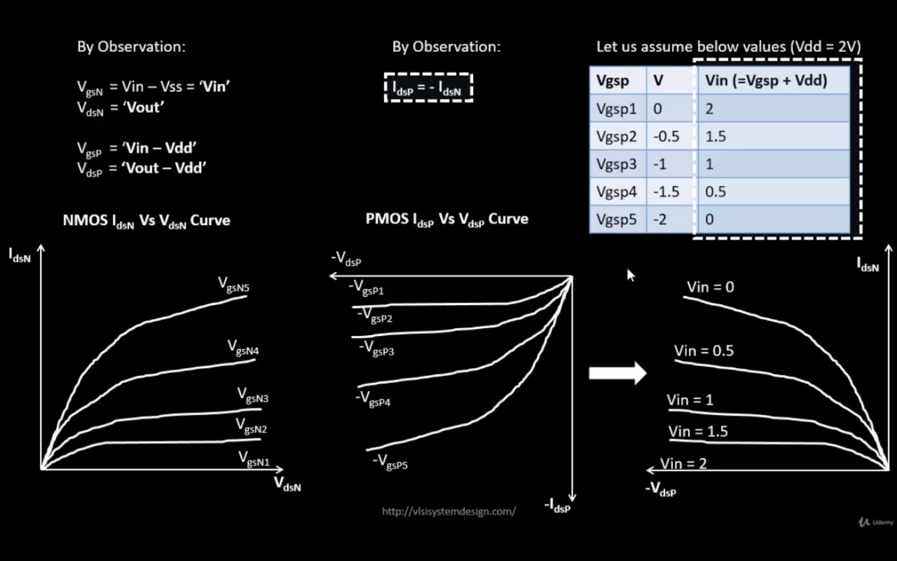
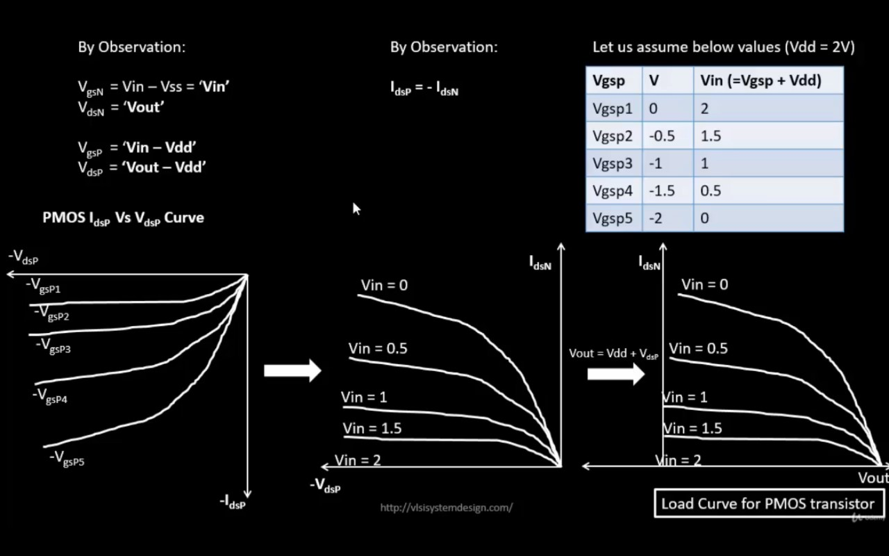
- Intersection points in NMOS and PMOS POV combined to plot **CMOS VTF**.
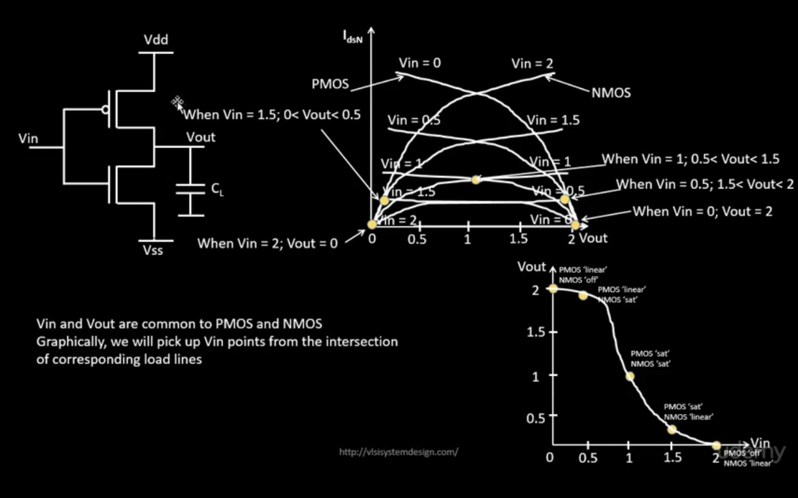

---

## Lab – Day 2 Images

### 1) Short Channel SPICE Code
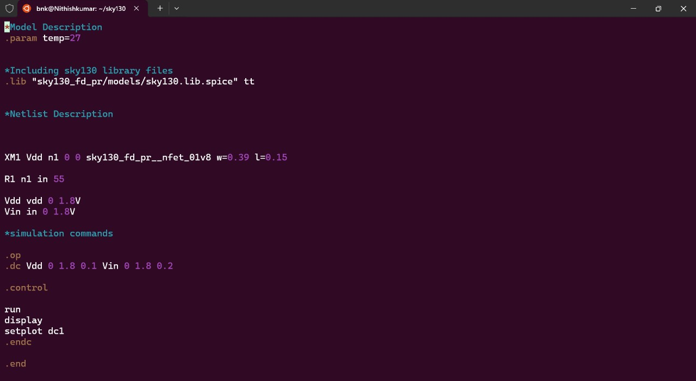

### 2) Short Channel SPICE Output
```bash
ngspice day2_nfet_idvds_L015_W039.spice 
```
```ngspice 
plot -vdd#branch
```
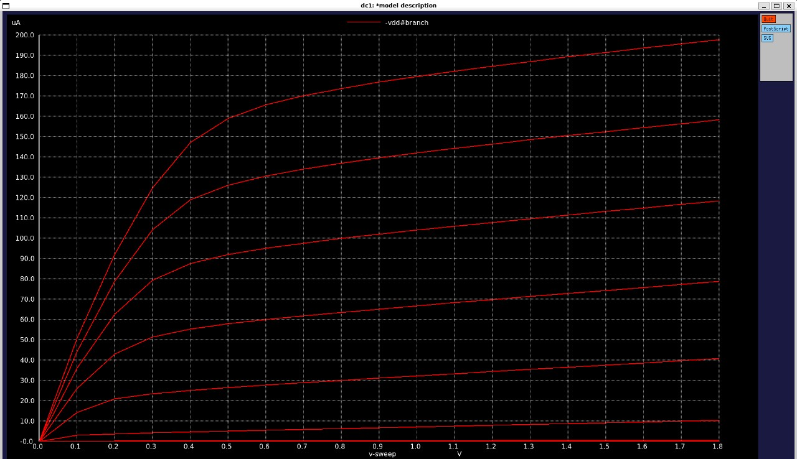  
**Observation:** The graph shows **linear behavior for higher VDS values due to velocity saturation**.

### 3) Short Channel VGS Code
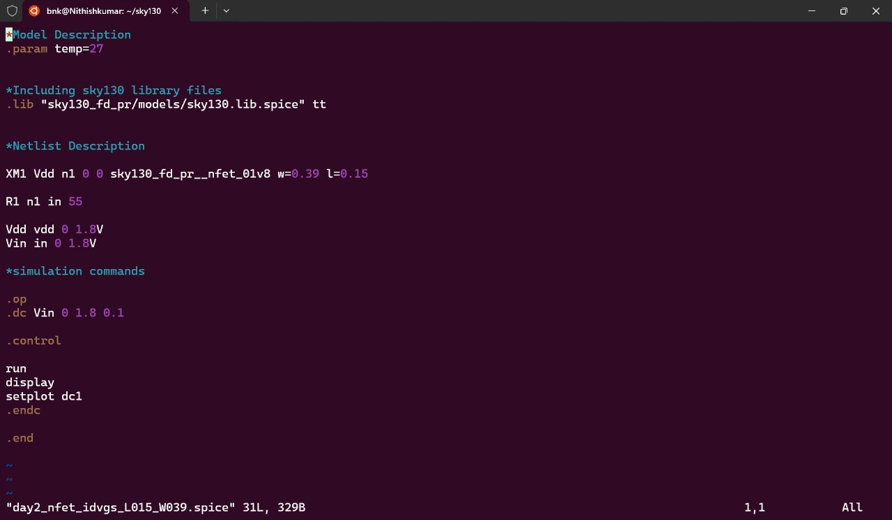

### 4) Short Channel VGS Output
```bash
ngspice day2_nfet_idvgs_L015_W039.spice 
```
```ngspice 
plot -vdd#branch
```
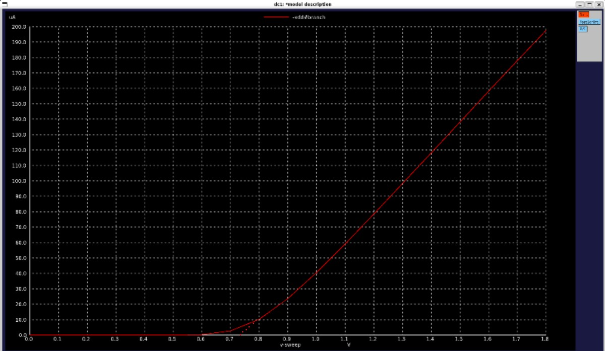  
**Observation:** Threshold voltage (Vth) found to be **0.74 V** from this graph.

# Day 3

---

## Overview
Day 3 focuses on **CMOS inverter VTC analysis**, SPICE deck creation, and evaluation of **switching threshold**, **rise/fall delay**, and **robustness** across multiple W/L ratios.

---

## VTC and CMOS SPICE Setup
- SPICE deck for CMOS inverter includes:
  - Circuit connectivity
  - Sweep input data
  - Netlist of the circuit
- Note: Vin / VDD is often scaled as \( 10 \times \) channel length (in μm)
- Proper VTC alignment: **PMOS width (W) ≈ 2 × NMOS width**  
- CMOS inverter robustness evaluated by:
  1. Switching threshold (Vm)
  2. Noise margin
  3. Power supply scalability
  4. Device variation

---

- **Definition:** Input voltage where Vin = Vout  
- Condition:  
  VDS = VGS,  IDS_P = - IDS_N

- **Drain Current Equations:**

  IDS_N = kn * (Vm - Vt) * VDSAT_N - (VDSAT_N^2 / 2)

  IDS_P = kp * (Vm - VDD - Vt) * VDSAT_P - (VDSAT_P^2 / 2)

- **Equating currents:**

  Vm = r * VDD / (1 + r),  where r = (kp * VDSAT_P) / (kn * VDSAT_N)

- kn, kp = transconductance × (W/L)  
- Vm changes with W/L ratio
----

## Lab – Day 3

### Part 1: Switching Threshold and Rise/Fall Time from VTC Graph

**Objective:**  
Determine the **switching threshold (Vm)** and **rise/fall delay** of a CMOS inverter using the VTC graph.

**Procedure & Observations:**

1. VTC SPICE simulation is run for the CMOS inverter.
2. **Switching Threshold (Vm):**  
   - Draw a 45° line from the origin on the VTC graph.
   - The intersection point of this line with the VTC curve is taken as **Vm**.
   - Observed values:  
     - Vm = 0.879 V, 0.844 V
3. **Rise/Fall Delay:**  
   - From the transient SPICE simulation:
     - **Fall delay:** Difference between the midpoint of **input rising edge** and **output falling edge**.
     - **Rise delay:** Difference between the midpoint of **input falling edge** and **output rising edge**.
   - Observed values:  
     - Rise time = 0.3 ns  
     - Fall time = 0.3 ns

**Images:**

- VTC SPICE Deck  
  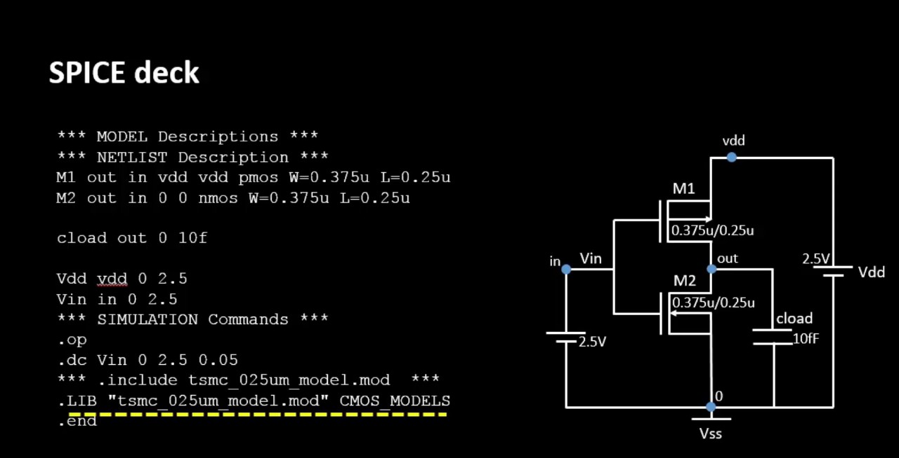

- VTC Code  
  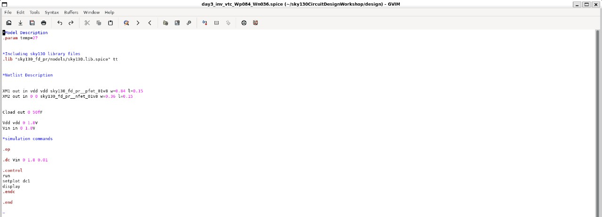

- VTC Output  
  ```bash
  ngspice day3_inv_vtc_Wp084_Wn036.spice  
  ```
  ```ngspice 
  plot -vdd#branch
  ```
  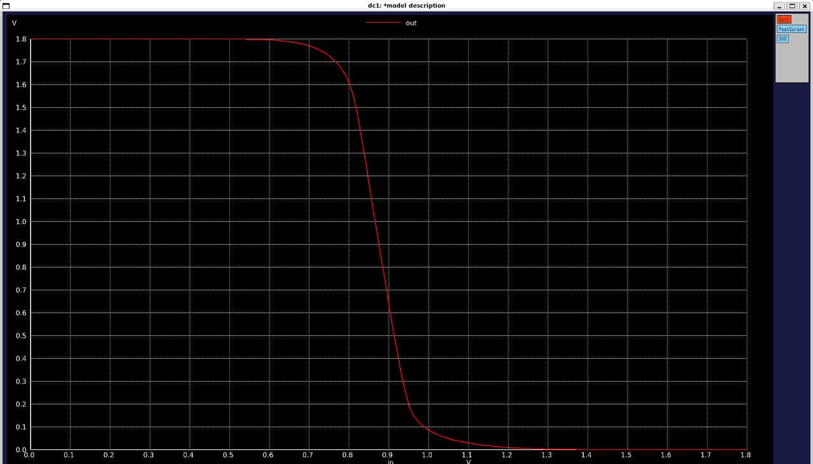

- Switching Threshold  
  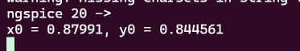

- Rise and Fall Delay 
   ```bash
  ngspice day3_inv_tran_Wp084_Wn036.spice  
  ```
  ```ngspice 
  plot out vs time in
  ```
  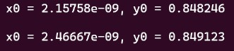
  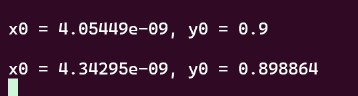

---

### Part 2: Multiple W/L Ratio Analysis

**Objective:**  
Analyze CMOS inverter behavior under **different W/L ratios** (PMOS width varied, NMOS width constant) to observe trends in switching threshold and rise/fall delay.

**Procedure & Observations:**

1. Several W/L combinations are simulated:
   - W = 0.375 μm, 2W, 3W, 4W, 5W  
   - L = 0.25 μm  
2. **Trends Observed:**  
   - Switching threshold Vm remains nearly constant across different ratios.
   - Rise and fall delays are almost unchanged except when **PMOS width = 2 × NMOS width**, where **rise = fall delay**.
   - This ratio gives a **balanced delay** suitable for **clock cell buffers**.
   - Other ratios can be used in **datapath circuits** where asymmetric delays may be acceptable.
3. **Application:**  
   - CMOS inverter robustness ensures consistent switching threshold and stable timing across process variations.
   - Selecting PMOS width = 2 × NMOS width is a common design choice for **balanced inverter circuits**.

**Image Placeholder:**

- Robust Table / Multiple W/L Ratios  
  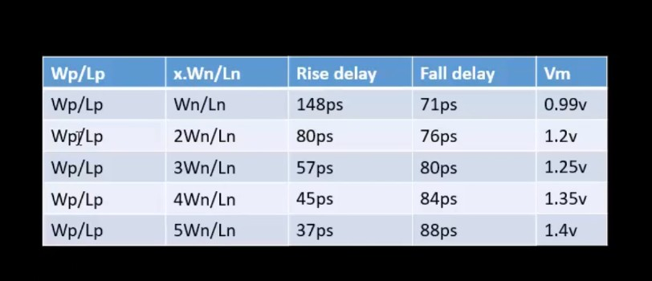
