# Week 4 — CMOS Circuit Design & SPICE Simulation

## Overview
This week focuses on transistor-level CMOS behavior, how MOSFET W/L ratio affects delay, CMOS voltage transfer characteristics, noise margins, and robustness analysis. SPICE simulation validates timing models used by STA (OpenSTA).

---

<details>
<summary><h2>Day 1: CMOS Basics & MOSFET Operation</h2></summary>

### Overview
Day 1 focuses on transistor-level CMOS behavior, how MOSFET W/L ratio affects delay, and how SPICE validates timing models used by STA (OpenSTA).

### CMOS Basics
- **PMOS**: N-type substrate, P-type doping (minority P, majority N)
- **NMOS**: P-type substrate, N-type doping (minority N, majority P)
- **W/L ratio** controls drain current → affects propagation delay
- Delay tables (input slew vs output load) are generated using **SPICE**, then used by **STA**

### Semiconductor & PN Junction Revision
Extrinsic semiconductors are formed by doping with trivalent dopants (B, Al, Ga) for P-type and pentavalent dopants (P, As, Sb) for N-type. PN junctions create a depletion region and built-in potential of approximately 0.7 V for silicon and 0.3 V for germanium.

**Biasing Effects:**
- Forward bias → depletion shrinks → current flows
- Reverse bias → depletion widens → current blocked (only small leakage)

### MOSFET Basics
NMOS transistors consist of a P-type substrate, SiO₂ oxide layer, and N+ source/drain regions. The four terminals are Gate, Source, Drain, and Body. Operation depends on VGS and VDS.

### NMOS Operation Modes

#### Cut-Off Region (VGS < Vth)
No inversion layer forms. Resistance is very high with no current flow.

#### Threshold Formation (VGS = Vth)
As VGS increases, the gate attracts electrons and an inversion layer forms at the surface. At VGS = Vth, the channel is created. The body effect increases Vth when source-body reverse bias exists.

#### Linear (Triode) Region (VGS > Vth and VDS < VGS - Vth)
The channel exists from source to drain, and the MOSFET behaves like a variable resistor.

**Drain Current Equation (Linear Region):**

```
ID = μn * Cox * (W/L) * [(VGS - Vth) * VDS - (VDS² / 2)]

Or using kn = μn * Cox * (W/L):

ID = kn * [(VGS - Vth) * VDS - (VDS² / 2)]

For very small VDS:

ID ≈ kn * (VGS - Vth) * VDS
```

#### Saturation Region (VDS ≥ VGS - Vth)
Pinch-off occurs when the channel disappears near the drain side. Current becomes almost independent of VDS.

**Drain Current Equation (Saturation, without channel-length modulation):**

```
ID = (1/2) * kn * (VGS - Vth)²
```

**With channel-length modulation (λ):**

```
ID = (1/2) * kn * (VGS - Vth)² * (1 + λ * VDS)
```

This shows ID slightly depends on VDS due to effective channel shortening.

### SPICE vs STA
STA uses delay tables generated from SPICE data. SPICE simulates transistor-level models to extract delay, slew, and current, thereby verifying STA assumptions.

### Lab – Day 1

#### 1) SPICE Netlist


#### 2) SPICE Code


#### 3) SPICE Simulation
```bash
ngspice day1_nfet_idvds_L2_W5.spice
plot -vdd#branch
```


#### 4) SPICE Output
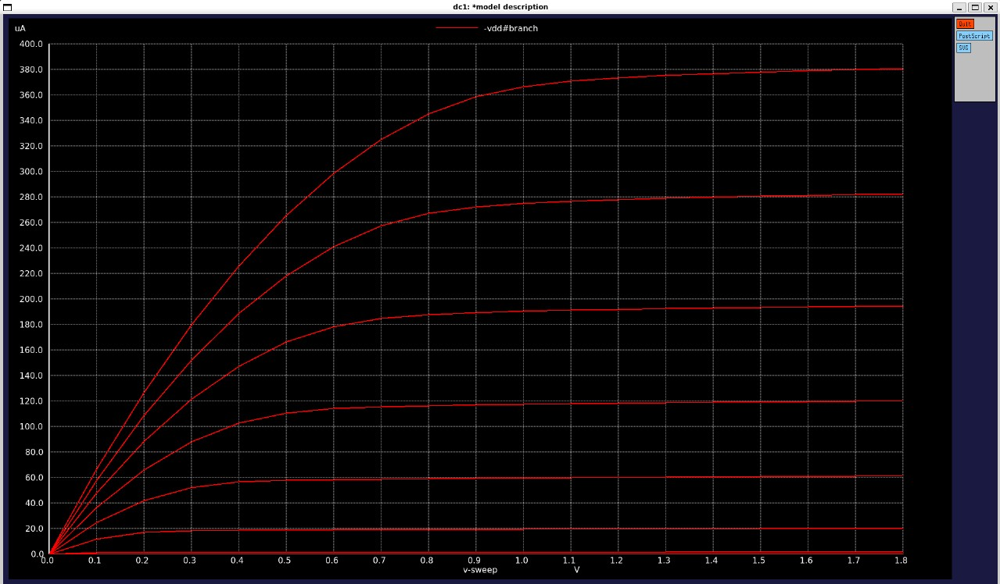

#### 5) VDS and ID Value of One Instance


</details>

---

<details>
<summary><h2>Day 2: Short Channel Effects & CMOS Voltage Transfer Characteristics</h2></summary>

### Overview
Day 2 focuses on short-channel NMOS effects, CMOS voltage transfer characteristics (VTC), and the impact of channel length on drain current.

### Short Channel NMOS Effects
Two NMOS transistors with the same W/L ratio but different absolute W and L values show different Id vs VGS curves. For short channel devices (L = 250 nm), ID vs VGS shows linear dependence even after pinch-off, due to the velocity saturation effect. At high electric fields, carrier velocity saturates due to scattering, with velocity proportional to induced charges.

#### NMOS Operating Regions (Short Channel)
1. Cut-off
2. Linear (triode)
3. Saturation
4. Velocity Saturation

#### Full Drain Current Equation (Short Channel, Unified Model)

```
ID = kn * (VGS - vmin) - (vmin² / 2) * (1 + λ * VDS)

Where:
vmin = min(vgs(saturation mode), vds(linear mode), vsat(velocity saturation mode))
```

**Key Observation:** Shorter channel length reduces drain current, while longer channel length increases it. Although W/L ratio remains the same, absolute length affects ID directly.

### CMOS Voltage Transfer Characteristics (VTC)

#### NMOS Characteristics
- Gate = VDD, Body = GND
- Can pass **0** from source easily (VGS > Vth)
- If source = VDD, NMOS passes up to VDS - Vth
- Acts as **strong 0, weak 1** pull-down transistor

#### PMOS Characteristics
- Gate = GND, Body = VDD
- Can pass **VDD** from source easily (VSG > Vth)
- If source = 0, PMOS passes up to Vth
- Acts as **strong 1, weak 0** pull-up transistor

#### CMOS Inverter Operation
- If VIN = VDD → NMOS on → load capacitor discharged
- If VIN = 0 → PMOS on → load capacitor charged

#### Nomenclature

| Symbol | Description |
|--------|-------------|
| GS | Gate to Source |
| DS | Drain to Source |
| VGSN | VIN (NMOS) |
| VDSN | VOUT (NMOS) |
| VGSP | VIN - VDD (PMOS) |
| VDSP | VOUT - VDD (PMOS) |
| IDSN | NMOS Drain Current |
| IDSP | PMOS Drain Current |
| IDSN = -IDSP | Current relationship |

#### VTC Analysis


### Lab – Day 2

#### 1) Short Channel SPICE Code


#### 2) Short Channel SPICE Output
```bash
ngspice day2_nfet_idvds_L015_W039.spice
plot -vdd#branch
```


**Observation:** The graph shows linear behavior for higher VDS values due to velocity saturation.

#### 3) Short Channel VGS Code


#### 4) Short Channel VGS Output
```bash
ngspice day2_nfet_idvgs_L015_W039.spice
plot -vdd#branch
```


**Observation:** Threshold voltage (Vth) found to be 0.74 V from this graph.

</details>

---

<details>
<summary><h2>Day 3: CMOS Inverter VTC Analysis & Switching Characteristics</h2></summary>

### Overview
Day 3 focuses on CMOS inverter VTC analysis, SPICE deck creation, and evaluation of switching threshold, rise/fall delay, and robustness across multiple W/L ratios.

### VTC and CMOS SPICE Setup
SPICE decks for CMOS inverters include circuit connectivity, sweep input data, and netlist specifications. A common design rule is that Vin/VDD is scaled as 10× channel length (in μm), and proper VTC alignment requires PMOS width ≈ 2× NMOS width. CMOS inverter robustness is evaluated by switching threshold (Vm), noise margin, power supply scalability, and device variation.

### Switching Threshold (Vm)

**Definition:** Input voltage where Vin = Vout

**Condition:** VDS = VGS and IDS_P = -IDS_N

**Drain Current Equations:**

```
IDS_N = kn * (Vm - Vt) * VDSAT_N - (VDSAT_N² / 2)

IDS_P = kp * (Vm - VDD - Vt) * VDSAT_P - (VDSAT_P² / 2)
```

**Equating Currents:**

```
Vm = r * VDD / (1 + r)

Where: r = (kp * VDSAT_P) / (kn * VDSAT_N)
```

Where kn and kp are transconductance parameters multiplied by their respective W/L ratios. Vm changes with W/L ratio.

### Lab – Day 3

#### Part 1: Switching Threshold and Rise/Fall Time from VTC Graph

**Objective:** Determine the switching threshold (Vm) and rise/fall delay of a CMOS inverter using the VTC graph.

**Procedure & Observations:**

1. VTC SPICE simulation is run for the CMOS inverter
2. **Switching Threshold (Vm):** Draw a 45° line from the origin on the VTC graph. The intersection point with the VTC curve is taken as Vm. Observed values: Vm = 0.879 V, 0.844 V
3. **Rise/Fall Delay:** From transient SPICE simulation:
   - **Fall delay:** Difference between midpoint of input rising edge and output falling edge
   - **Rise delay:** Difference between midpoint of input falling edge and output rising edge
   - Observed values: Rise time = 0.3 ns, Fall time = 0.3 ns

**Images:**

- VTC SPICE Deck: 
- VTC Code: 
- VTC Output:
```bash
ngspice day3_inv_vtc_Wp084_Wn036.spice
plot -vdd#branch
```

- Switching Threshold: 
- Rise and Fall Delay:
```bash
ngspice day3_inv_tran_Wp084_Wn036.spice
plot out vs time in
```


#### Part 2: Multiple W/L Ratio Analysis

**Objective:** Analyze CMOS inverter behavior under different W/L ratios (PMOS width varied, NMOS width constant) to observe trends in switching threshold and rise/fall delay.

**Procedure & Observations:**

1. Several W/L combinations are simulated: W = 0.375 μm, 2W, 3W, 4W, 5W with L = 0.25 μm
2. **Trends Observed:**
   - Switching threshold Vm remains nearly constant across different ratios
   - Rise and fall delays are almost unchanged except when PMOS width = 2× NMOS width, where rise = fall delay
   - This ratio gives a balanced delay suitable for clock cell buffers
   - Other ratios can be used in datapath circuits where asymmetric delays may be acceptable
3. **Application:** CMOS inverter robustness ensures consistent switching threshold and stable timing across process variations. Selecting PMOS width = 2× NMOS width is a common design choice for balanced inverter circuits.

**Images:**
- Robust Table / Multiple W/L Ratios: 

</details>

---

<details>
<summary><h2>Day 4: Noise Margins & CMOS Robustness</h2></summary>

### Overview
Day 4 focuses on noise margin extraction from CMOS inverter VTC, practical voltage levels, and logic interpretation rules.

### Ideal vs Practical CMOS Behavior
In an ideal CMOS inverter, the switching point at VDD/2 has an infinite slope (output changes abruptly from 1 to 0 with zero change in input). However, in practical circuits, the slope is finite, resulting in imperfect inversion.

### Practical Voltage Levels

| Region | Output Level |
|--------|--------------|
| 0 to VIL | VOH (logic 1) |
| VIH to VDD | VOL (logic 0) |
| VIL to VIH | Undefined / Transition Region |

**Definitions:**
- **VIL:** Voltage Input Low
- **VOL:** Voltage Output Low
- **VIH:** Voltage Input High
- **VOH:** Voltage Output High

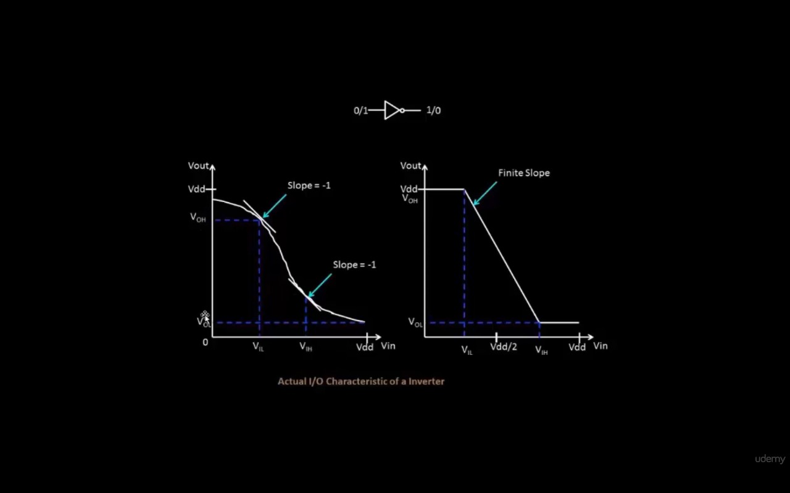

### Logic Interpretation Rules

- Any value greater than VOH is logic 1 and must also be above VIH
- Any value lesser than VOL is logic 0 and must also be below VIL
- VIL to VIH is an undefined zone with finite slope

If noise bumps occur within the noise margin zone, the inverter still correctly interprets logic. Noise margins are used in digital design, while the undefined zone (VIL to VIH) is relevant in analog design.

### Practical Order of Voltage Levels

```
VDD > VOH > VIH > VIL > VOL > 0
```

### Effect of Transistor Sizing

- Increasing W/L of PMOS compared to NMOS creates a low-resistance pull-up path, increasing high noise margin (strong logic 1, weaker logic 0)
- Increasing W/L of NMOS compared to PMOS creates a low-resistance pull-down path, increasing low noise margin (strong logic 0, weaker logic 1)

However, the difference in practical CMOS designs is usually small and does not heavily affect behavior.

### Noise Margin Extraction from VTC

Noise margin of CMOS is calculated by simulating the VTC curve.

**Procedure:**
1. Simulate CMOS inverter VTC
2. Identify points where slope = -1
   - First point gives VIL and VOH
   - Second point gives VIH and VOL
3. Use formulas:

```
NMh = VOH – VIH

NMl = VIL – VOL
```

### Lab – Day 4

#### 1) CMOS VTC SPICE Code
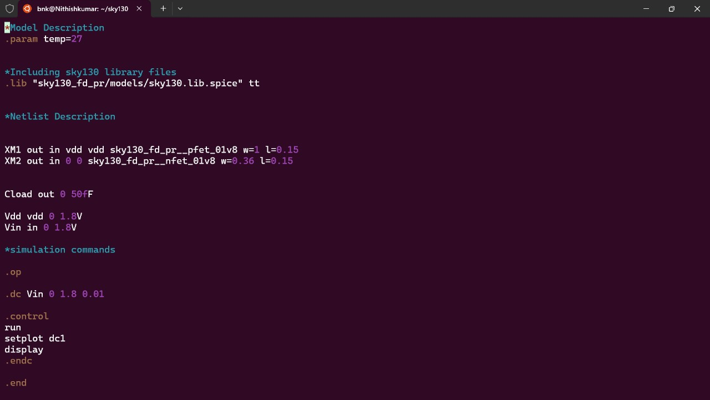

#### 2) CMOS VTC Simulation Output
```bash
ngspice day4_inv_noisemargin_wp1_wn036.spice
plot out vs in
```
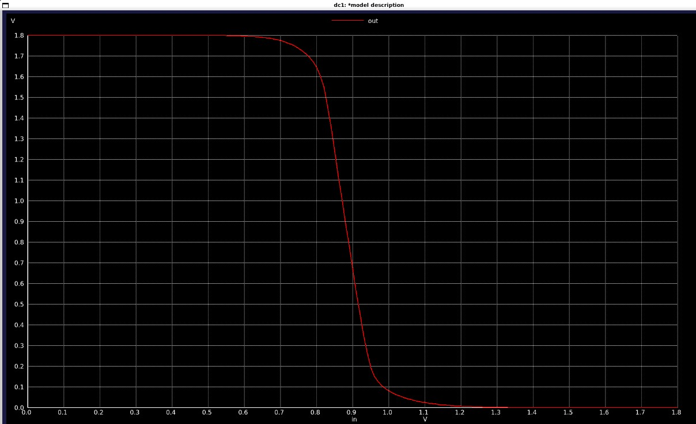

#### 3) CMOS Noise Margins Plot
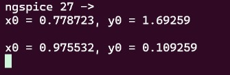

#### Observed Noise Margin Values

```
NMh = 1.69 - 0.97 = 0.72 V

NMl = 0.109 - 0.778 = 0.669 V
```

#### Conclusion
Noise margins quantify the robustness of a CMOS inverter. They are extracted from VTC using the slope = -1 method. Both NMh and NMl are sufficiently large, indicating reliable noise immunity. Small W/L variations affect margins slightly but do not significantly affect inverter performance.

**Images:**
- Robust Table with Noise Margins / Multiple W/L Ratios: 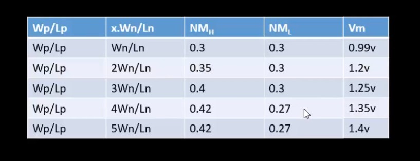

</details>

---

<details>
<summary><h2>Day 5: Power Supply Scalability & Device Variation</h2></summary>

### Overview
Day 5 focuses on CMOS inverter robustness under power supply scaling and device variations.

### Property 3: Power Supply Scalability

#### Advantages of Using Low Supply Voltage
- Lower power consumption
- Higher gain compared to using a higher supply voltage
- Better energy efficiency

#### Disadvantage
- Lower voltage increases delay (takes more time to charge/discharge load capacitance → slower operation)

#### VTC at Different Supply Voltages
VTC of CMOS inverter is simulated at different supply voltages (e.g., 1.8V and 0.8V). Result: CMOS characteristics (shape of VTC) do not change significantly with scaling.

**Gain Observation:**
- At VDD = 1.8V → Gain = 7.52
- At VDD = 0.8V → Gain = 9.11

Gain slightly increases as VDD decreases. However, overall CMOS VTC behavior remains similar.

### Lab – Power Supply Scaling

#### 1) Supply Variation SPICE Code
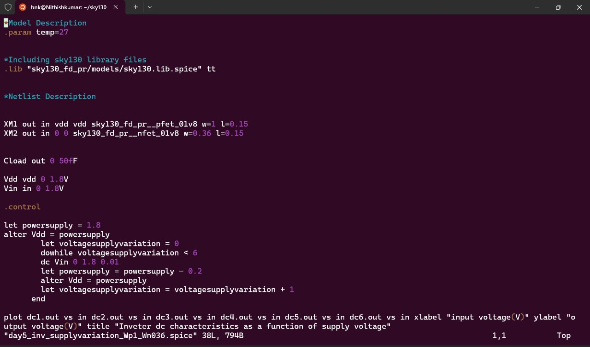

#### 2) Supply Variation Output (VTC)
```bash
ngspice day5_inv_supplyvariation_Wp1_Wn036.spice
plot out vs in
```
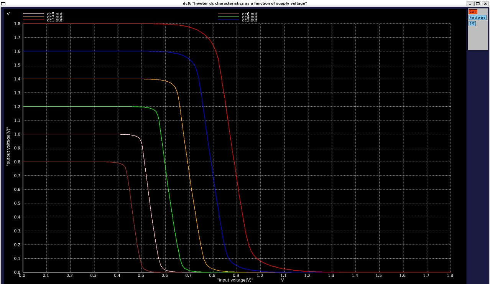

#### 3) High Power Supply Gain
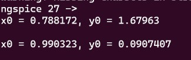

#### 4) Low Power Supply Gain
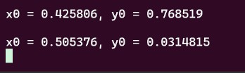

### Property 4: Device Variation

Device variations occur due to fabrication mismatch such as:
- Etching (variation in W and L)
- Oxide thickness variation

#### Impact on Device Parameters
- W/L ∝ Drain current
- Oxide capacitance (Cox) ∝ 1/oxide thickness (Cox ∝ drain current)

Even though these variations affect drain current, CMOS inverters remain robust and maintain functionality.

#### Device Variation Effects
To demonstrate robustness, different transistor widths are chosen: wide PMOS (strong pull-up with low resistance) and narrow NMOS (weak pull-down with high resistance).

**Observations:**
- Shift in Vm (switching threshold) is small (Vm found where 45° line intersects VTC)
- Noise margins NMh and NMl change very little
- Digital operation remains correct

### Lab – Device Variation

#### 1) Device Variation SPICE Code
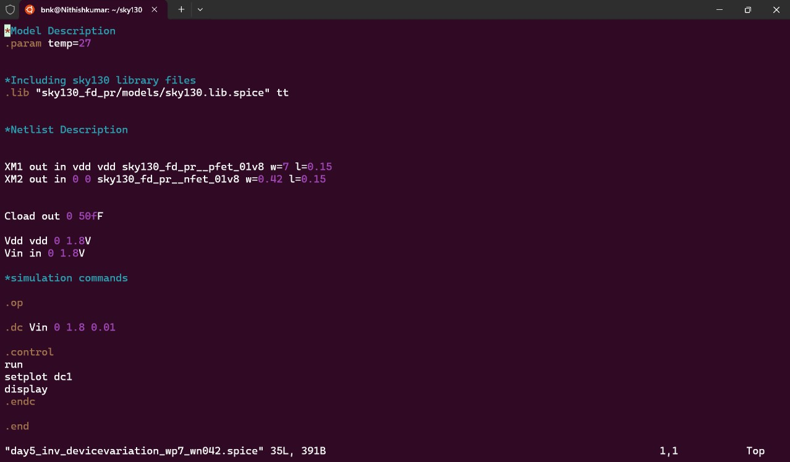

#### 2) Device Variation Output (VTC)
```bash
ngspice day5_inv_devicevariation_wp7_wn042.spice
plot out vs in
```
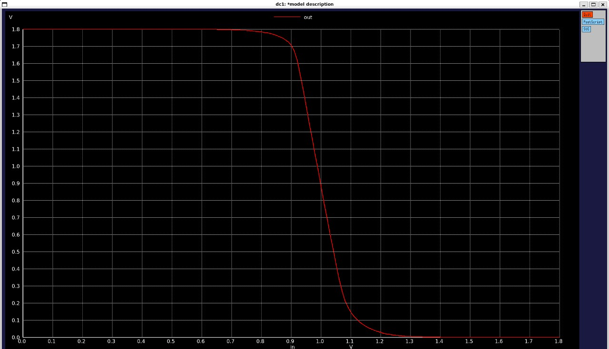

#### 3) Switching Threshold under Device Variation
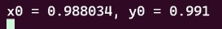

### Conclusion
CMOS inverter maintains operation even under power supply scaling and device variation. Shifts in switching threshold and noise margins are minimal. Robustness of CMOS ensures digital circuit functionality remains intact.

</details>

---

## Summary

This week covered comprehensive CMOS circuit analysis from transistor fundamentals through advanced robustness evaluation. Key topics included MOSFET operation modes, short-channel effects, voltage transfer characteristics, noise margins, and the effects of power supply scaling and device variations. All concepts were validated through SPICE simulations, demonstrating the relationship between circuit design and timing analysis tools.
