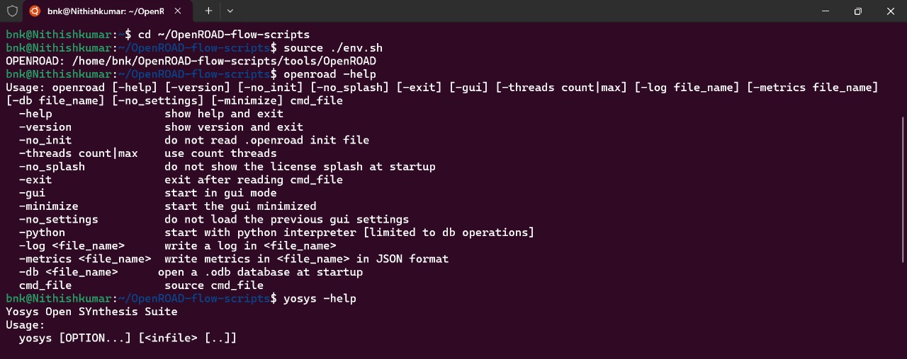

# Week 5 Task – OpenROAD Flow Setup and Floorplan + Placement

## Objective
To set up the OpenROAD Flow Scripts environment and execute the Floorplan and Placement stages of the physical design flow. This task transitions you from SPICE-level transistor design (Week 4) to backend implementation, where logic is converted into an actual physical layout.

## Why This Task Is Important
After understanding how timing arises from transistor-level circuits, it’s time to see how
those circuits are physically realized on silicon. This task introduces you to OpenROAD, an open-source RTL-to-GDSII flow widely used in academic and industrial research.

Learning to perform floorplanning and placement helps you understand:
• How design constraints are applied before routing.
• How standard cells are arranged to minimize delay, area, and congestion.
• How physical design choices affect timing and manufacturability.
This is your first step toward a full physical implementation flow in VLSI design.
Task Reference
Use the following repository as your reference for installation and running the required flow
steps:
OpenROAD Reference – https://github.com/spatha0011/spatha_vsdhdp/blob/main/Day14/README.md

## Terminal Screenshots with Commands

### 1. Clone the OpenROAD Repository

```bash
git clone --recursive https://github.com/The-OpenROAD-Project/OpenROAD-flow-scripts
cd OpenROAD-flow-scripts
```

### 2. Dependency Installation
```bash
sudo ./setup.sh
```


---

### 3. OpenROAD Build
```bash
rm -rf tools/OpenROAD/build
./build_openroad.sh --local --threads 1 --openroad-args "-DENABLE_DIST_TESTS=OFF"
```


---

### 4. Environment Setup & Verification
```bash
source ./env.sh
openroad -help
yosys -help
```


---

### 5. Design Flow Execution
```bash
cd ~/OpenROAD-flow-scripts/flow
make
```


---

### 6. GUI Generation
```bash
make gui_final
```


---

### 7. Directory Verification
```bash
ls OpenROAD-flow-scripts
ls flow
```


---

## 8. Generated Output Files
```bash
cd OpenROAD-flow-scripts/flow/results/nangate45/gcd/base
```


---

## Summary

**Steps Followed:**
Installed OpenROAD in WSL Ubuntu 22.04 by running dependency setup script, building from source with single-threaded compilation to optimize memory usage, sourcing environment variables, and executing the complete RTL-to-GDSII design flow on the default GCD design.

**Challenges & Solutions:**
Initial build failures were caused by gtest linking errors and out-of-memory issues with 8 threads; resolved by using `-DENABLE_DIST_TESTS=OFF` flag to skip test compilation and reducing threads to 1 for stable memory management in WSL environment.

**Username:** `bnk@Nithishkumar`  
**System:** WSL Ubuntu 22.04 LTS  
**Status:** ✅ Installation & Flow Execution Complete
